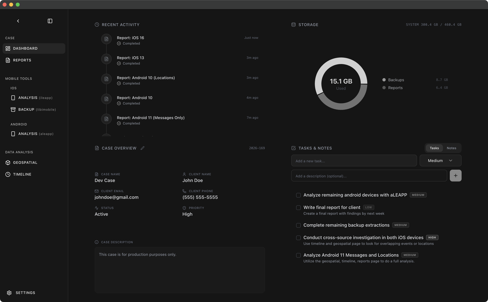
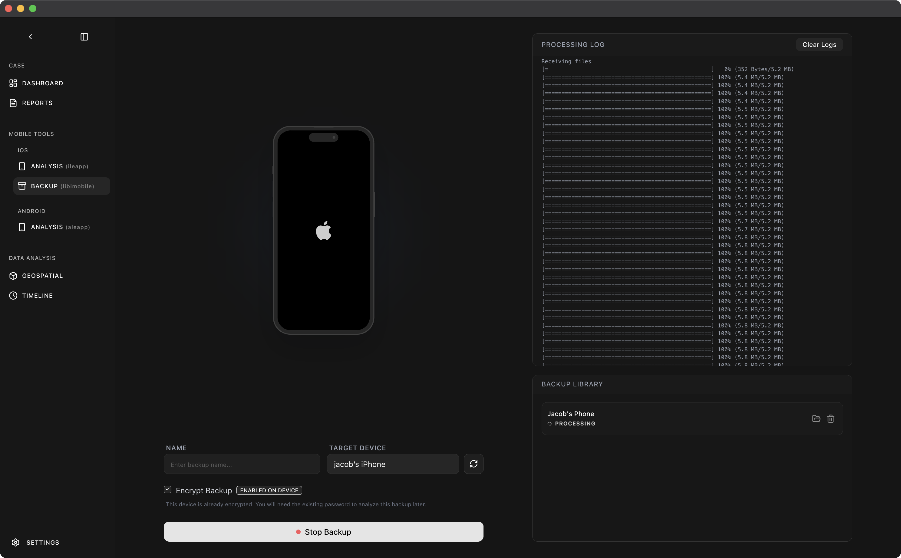
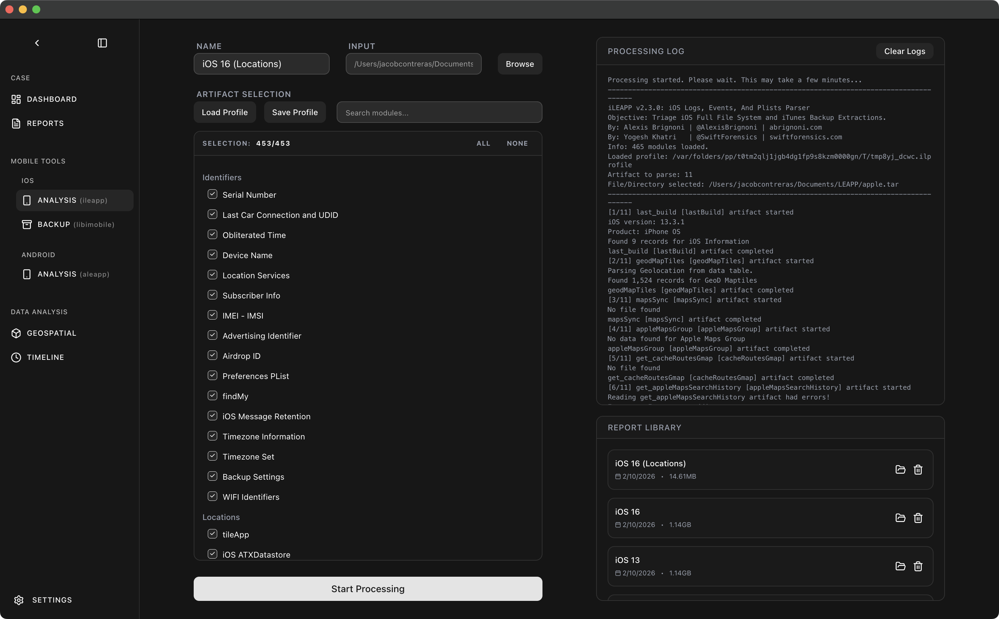
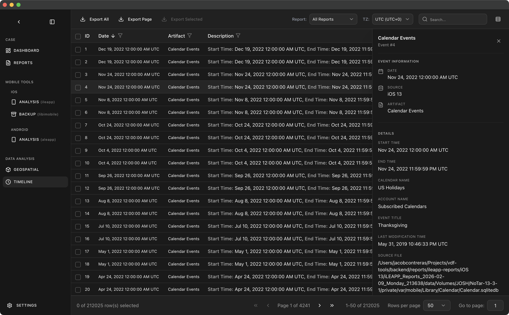
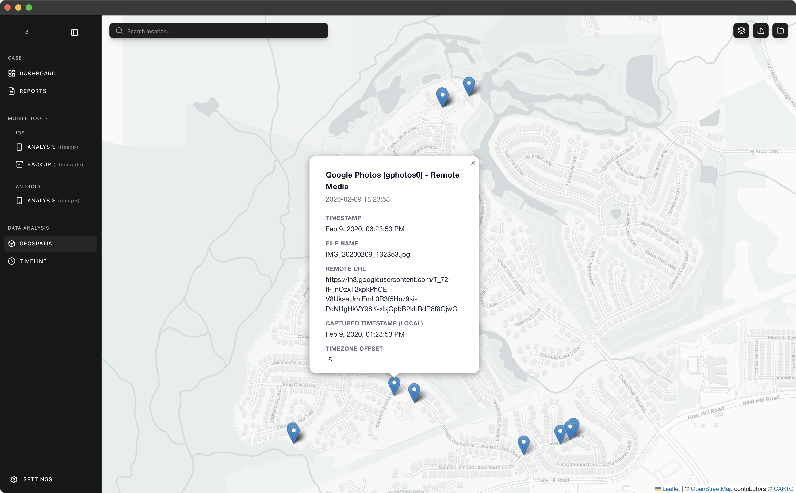
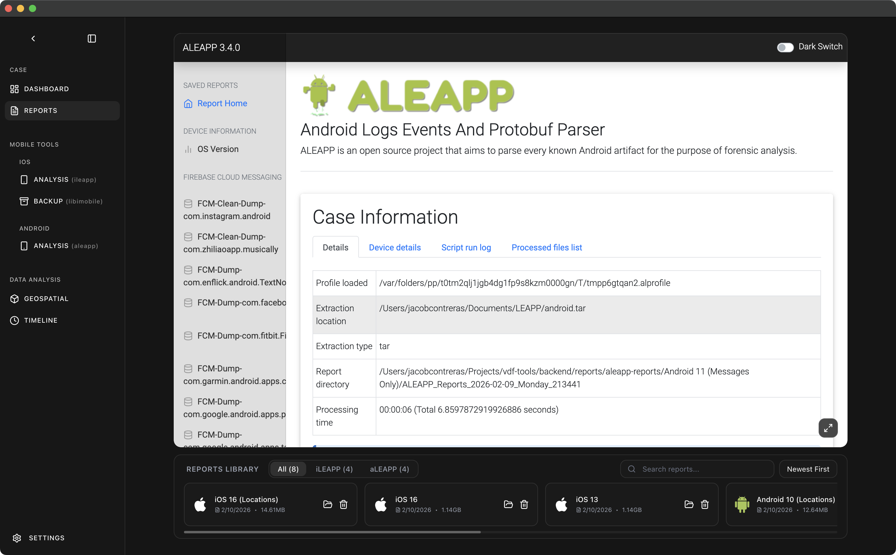

# Veritas Lab


  

> **Beta (v0.1.0)**:
>This project is current in **Beta**, While it leverages industry-standard forensic tools (iLEAPP, aLEAPP, libimobiledevice), it remains a forensic best practice to always independently verify significant findings against raw data and secondary tools.

Veritas Lab is a forensic extraction and analysis suite built for speed and privacy.

**Co-developed with**: [Slay3r00](https://github.com/Slay3r00)

## Features
- **Device Extraction**: Extract iOS backups via USB using libimobiledevice. Supports encrypted and unencrypted backups with real-time progress tracking and automatic case organization.
- **LEAPP Analysis**: Integrated iLEAPP (iOS) and aLEAPP (Android) forensic parsers for automated artifact extraction. Processes call logs, messages, contacts, location data, app usage, and system events with embedded HTML report generation.
- **Timeline Events**: Chronological reconstruction from multiple data sources with timezone-aware display, advanced filtering by artifact type, cross-source correlation, and full-text search across all timeline events.
- **Geospatial Data Viewer**: Interactive mapping of GPS coordinates, cell tower locations, Wi-Fi access points, and photo EXIF data. Supports KML/KMZ imports, heat maps, marker clustering, and multi-layer visualization with Leaflet.
- **Local-First & Private**: Forensic extraction and processing happen entirely on your machine. No forensic data from your cases is ever transmitted to external servers.

## Showcase

#### Dashboard


#### Backup Extraction


#### Artifact Analysis


#### Timeline Events


#### Location Mapping


#### Embedded LEAPP Reports


## Privacy & Data Locality

Veritas Lab is designed to prioritize your privacy and the security of forensic data. Understanding where data stays local and where external connections are made is critical for forensic integrity.

### What Stays Local
- **Forensic Extraction**: All device imaging and backup extractions are performed locally via USB.
- **Artifact Parsing**: The iLEAPP and aLEAPP engines run entirely within your local environment.
- **Case Database**: All investigative data, metadata, and case files are stored on your local disk.
- **Analysis & Timeline**: Data correlation and timeline reconstruction are 100% offline.

### Non-Local Dependencies (Must be enabled in settings)
While processing is local, certain UI and utility features require an internet connection:
- **Map Page**: Rendering map tiles and layers requires connecting to providers (Google, Carto, OpenStreetMap).
- **Location Search**: Geocoding and searching for addresses (via Nominatim) is performed via external API calls.
- **Tool Management**: Checking for updates and downloading the latest forensic tool versions requires access to GitHub and PyPI.
- **Typography**: Interface fonts are loaded via Google Fonts.

## Quick Start
1. **Launch**: Open Veritas Lab on your workstation.
2. **Create Case**: Create a new case and add relevant investigation details.
3. **Connect**: Navigate to the **Backups** page and connect the target device via USB.
4. **Extract**: Start the local extraction to image the device.
5. **Analyze**: Navigate to the **Analysis** page to process the extracted data.
6. **Timeline**: Navigate to the **Timeline** page to view the reconstructed event history.
7. **Map**: Navigate to the **Map** page to visualize geographic data.

## Tech Stack
- **Desktop**: [Electron](https://www.electronjs.org/)
- **Frontend**: [React](https://reactjs.org/), [TypeScript](https://www.typescriptlang.org/), [Tailwind CSS](https://tailwindcss.com/)
- **Backend**: [Python](https://www.python.org/), [FastAPI](https://fastapi.tiangolo.com/), [Pydantic](https://docs.pydantic.dev/)
- **Build**: [PyInstaller](https://pyinstaller.org/), [Vite](https://vitejs.dev/)

## Powered By
Veritas Lab stands on the shoulders of giants:
- [iLEAPP](https://github.com/abrignoni/iLEAPP) & [aLEAPP](https://github.com/abrignoni/aLEAPP)
- [libimobiledevice](https://libimobiledevice.org/)

## Development

### Environment Setup
1. **Node.js**: Ensure Node.js 18+ is installed.
2. **Python**: Python 3.9+ is required for the backend forensic engines.
3. **Virtual Environment**: Initialize the Python environment:
   ```bash
   cd backend
   python3 -m venv venv
   source venv/bin/activate
   pip install -r requirements.txt
   ```

### Installation
Install all dependencies for root, frontend, and electron layers:
```bash
npm run install:all
```

### Local Development
Start the concurrent development environment (Vite + Electron):
```bash
npm run dev:electron
```

### Build Procedures
Veritas Lab uses a multi-stage build process to bundle the Python environment, Vite frontend, and Electron shell.

#### Desktop Application
Build the full production bundle for your current platform:
- **macOS**: `npm run build:mac`
- **Windows**: `npm run build:win`
- **Linux**: `npm run build:linux`

#### Component Builds
- **Backend Only**: `npm run build:backend` (Packages Python via PyInstaller)
- **Frontend Only**: `npm run build:frontend` (Builds static Vite assets)

## License
Apache-2.0
